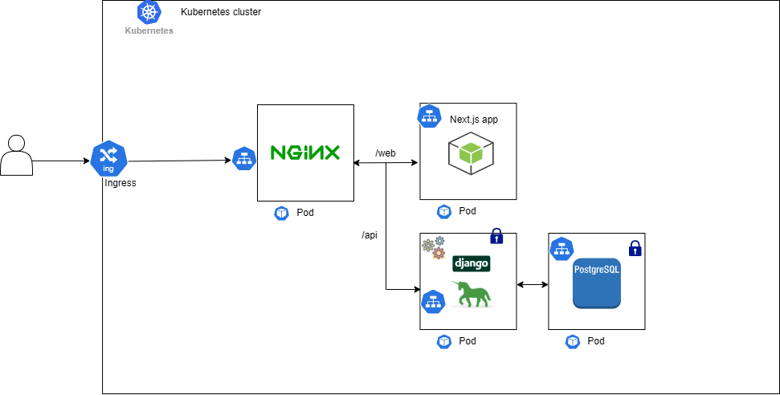

# next-app
This is an attempt on learning next js. For purpose of local development, I used docker-compose to build and run my Dockerfiles with volume mounted so that I can develop and also be able to test my code without having to re-build my images.

For production (Work In progress), I wanted to deploy in a kubernetes cluster and the architecture looks like this:

With the above architecture, I was able to use relative paths to fetch data from my backend service as such from my Next.js app:
`const response = await fetch("/api/skills");`

In this setup:
- Ingress Receives incoming requests from external clients and routes them to the Nginx reverse proxy.
- The Nginx service acts as a reverse proxy, forwarding requests from the frontend service to the backend service.
- Requests from the frontend service are first directed to the Nginx service, which then forwards them to the backend service.
- Responses from the backend are sent back through the Nginx service to the frontend service.
- Both the frontend and backend services serve their respective files and applications.

TODO:
- Making https requests.
- Deploy in the cloud service provider.
