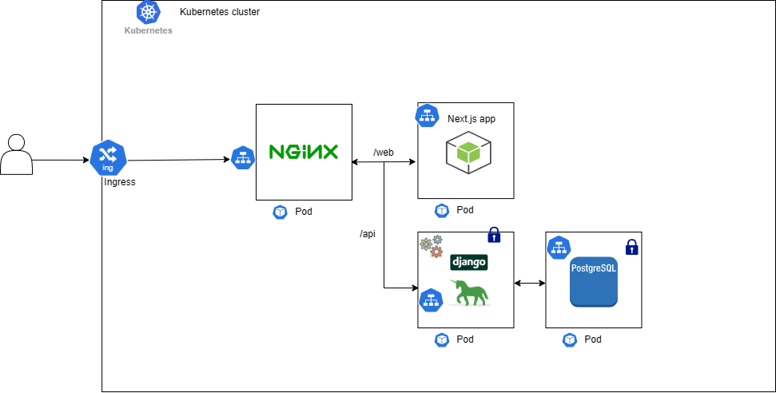

# next-app
This project is a learning attempt with Next.js. For local development, I use Docker Compose to build and run my Dockerfiles with volume mounts, allowing for live code changes without rebuilding images.

## Production (Kubernetes & Helm)
For production (Work In Progress), the app is deployed in a Kubernetes cluster. The architecture looks like this:



With this architecture, the Next.js app can fetch data from the backend using relative paths, e.g.:
`const response = await fetch("/api/skills");`

### How Traffic Flows
- **Ingress** receives incoming requests and routes them to the Nginx reverse proxy.
- **Nginx** acts as a reverse proxy, forwarding requests from the frontend to the backend service.
- Requests from the frontend go to Nginx, which then forwards them to the backend.
- Responses from the backend are sent back through Nginx to the frontend.
- Both frontend and backend serve their respective files/applications.

## Port Forwarding (for Local Access)
If you want to access your site locally without configuring DNS or Ingress, you can use port forwarding:

```
kubectl port-forward service/nginx 8080:80
```
Then open [http://localhost:8080](http://localhost:8080) in your browser.

## Helm Usage
Helm is used to manage Kubernetes manifests for this project. Helm allows you to templatize your Kubernetes YAML files and manage deployments, upgrades, and rollbacks easily.

### Common Helm Commands
- **Install:**
	```
	helm install portfolio ./chart
	```
- **Upgrade:**
	```
	helm upgrade portfolio ./chart
	```
- **Uninstall:**
	```
	helm uninstall portfolio
	```

### Helm Chart Structure
- `values.yaml`: Central place for configuration (images, ports, env vars, etc.)
- `templates/`: Contains Kubernetes manifests (deployments, services, ingress, etc.)

## TODO
- Enable HTTPS requests
- Deploy to a cloud service provider
